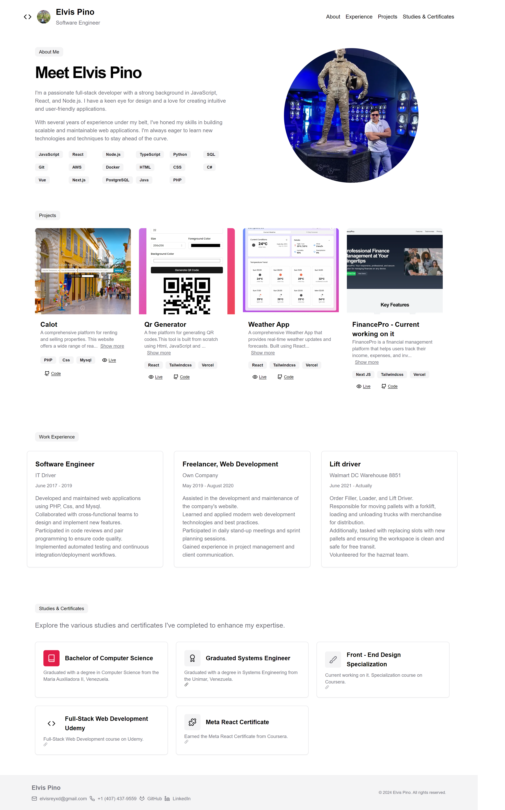

# My-Portfolio
live preview https://my-porfolio-next.vercel.app/
## technologies 💻

 
<h3 align="center">My Portfolio</h3>

                                       

 

I'm a passionate full-stack developer with a strong background in JavaScript, React, and Node.js. I have a keen eye for design and a love for creating intuitive and user-friendly applications.

With several years of experience under my belt, I've honed my skills in building scalable and maintainable web applications. I'm always eager to learn new technologies and techniques to stay ahead of the curve.

                                                             
</table>                                                                                 

