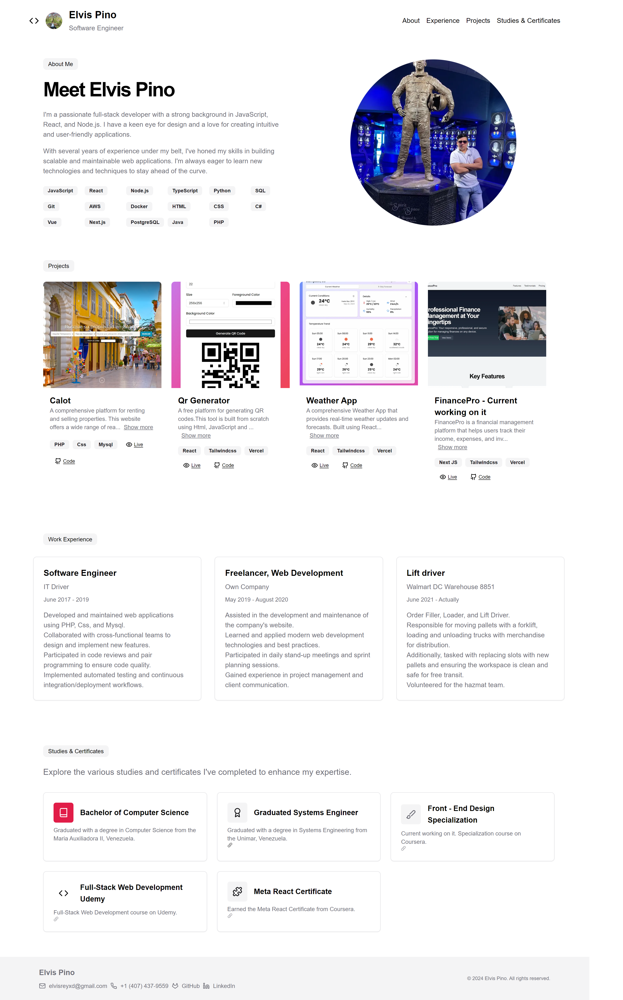

# Elvis Pino — Portfolio

Personal portfolio site for Elvis Pino, Senior Full-Stack Engineer (Applied AI). Single-page site built with the Next.js App Router, fully bilingual (English / Spanish) with light and dark themes.

**Live:** <https://my-porfolio-next.vercel.app/>



## Tech stack

| Area | Choice |
| --- | --- |
| Framework | Next.js 16 (App Router, Turbopack) |
| Language | TypeScript 5 |
| UI | React 19, Tailwind CSS 3, shadcn/ui (new-york style) on Radix primitives |
| Motion | Framer Motion |
| Icons | lucide-react, @heroicons/react, @radix-ui/react-icons |
| Theming | next-themes (system / light / dark) |
| Fonts | Sora (display), Source Sans 3 (body), JetBrains Mono — via `next/font/google` |
| Images | next/image with sharp |
| Hosting | Vercel |

## Getting started

Requires Node.js 20.9+ (Next.js 16 minimum).

```bash
npm install
npm run dev     # http://localhost:3000
```

There are no environment variables and no backend — every piece of content is checked into the repo.

### Scripts

| Command | Description |
| --- | --- |
| `npm run dev` | Start the dev server |
| `npm run build` | Production build |
| `npm run start` | Serve the production build |
| `npm run lint` | ESLint 9 flat config (`next/core-web-vitals` + `next/typescript`) |

## Project structure

```text
src/
├─ app/
│  ├─ layout.tsx        # Fonts, SEO metadata, LanguageProvider + ThemeProvider
│  ├─ page.tsx          # Single page: Hero → About → Experience → Projects → Studies
│  ├─ globals.css       # Tailwind layers + CSS design tokens
│  └─ not-found.tsx
├─ components/
│  ├─ Header.tsx, HeroSection.tsx, About.tsx, WorkExperience.tsx,
│  │  Proyects.tsx, studies-and-certificates.tsx, Footer.tsx
│  ├─ theme-toggle.tsx, language-selector.tsx, back-to-top.tsx
│  └─ ui/               # shadcn/ui primitives (button, card, tabs, sheet, …)
├─ contexts/
│  └─ LanguageContext.tsx   # Language state + `t()` lookup, persisted to localStorage
├─ data/                # Content source of truth (projects, experiences, education, skills, contact)
├─ hooks/
│  ├─ useTranslation.ts     # Thin wrapper over LanguageContext
│  └─ use-active-section.ts # IntersectionObserver for nav highlighting
├─ locales/             # en.json / es.json — UI strings
├─ types/               # Shared TypeScript types for the data layer
└─ assets/              # Project screenshots imported by next/image
```

## How content works

Content lives in two places, and which one you edit depends on what you're changing.

**`src/data/*.ts` — the portfolio content.** Projects, jobs, education and skills are typed arrays (types in `src/types/`). Entries that need translating hold both languages inline and are resolved by a getter:

```ts
// src/data/projects.ts
const projectsData: TranslatableProject[] = [
  {
    id: "trading-platform",
    title: { en: "Algorithmic Trading Platform", es: "Plataforma de Trading Algorítmico" },
    // …
  },
];
```

`src/data/contact.ts` follows the same pattern with `getFooterSections(language)`.

**`src/locales/{en,es}.json` — the UI chrome.** Section headings, button labels and other static copy, grouped under `header`, `about`, `experience`, `projects`, `education`, `hero`, `footer`, `skillCategories` and `common`.

### Adding a project

1. Drop the screenshot in `src/assets/` (or `public/assets/` if you reference it by URL string).
2. Append an entry to `projectsData` in [`src/data/projects.ts`](src/data/projects.ts) with `en` and `es` copy for `title`, `description` and `shortDescription`.
3. Set `featured`, `status`, `technologies`, and `liveLink` / `codeLink` as appropriate.

### Internationalization

`LanguageProvider` ([`src/contexts/LanguageContext.tsx`](src/contexts/LanguageContext.tsx)) picks the language from `localStorage` (`preferred-language`), falling back to the browser locale, defaulting to English. Both translation files are bundled statically — there is no route-based i18n and no `/es` URL. Components read strings through `useTranslation()`:

```tsx
const { t, language, setLanguage } = useTranslation();
t("hero.title"); // dot-path lookup; returns the key itself if missing
```

### Theming

`next-themes` in `attribute="class"` mode with `defaultTheme="system"`. Colors are CSS variables defined in `src/app/globals.css` and mapped to Tailwind tokens in `tailwind.config.ts`, so `dark:` variants mostly come for free.

## CV downloads

The résumé PDFs are served from `public/`:

- English — `public/cv/Elvis-Pino-CV.pdf`
- Spanish — `public/cv/Elvis-Pino-CV-ES.pdf`

Note: duplicate copies also exist at `public/Elvis-Pino-CV.pdf` and `public/Elvis-Pino-CV-es.pdf`. The hero button links to the root copy while the About section links to the `/cv/` copy, so **update both when the CV changes** (or consolidate on one path).

## Deployment

Deployed on Vercel — pushes to `master` ship to production. No build configuration beyond the defaults; `next.config.mjs` is intentionally empty.

## Contact

- Email — elvisreyxd@gmail.com
- LinkedIn — <https://www.linkedin.com/in/elvis-pino-dev/>
- GitHub — <https://github.com/elvisxd>
